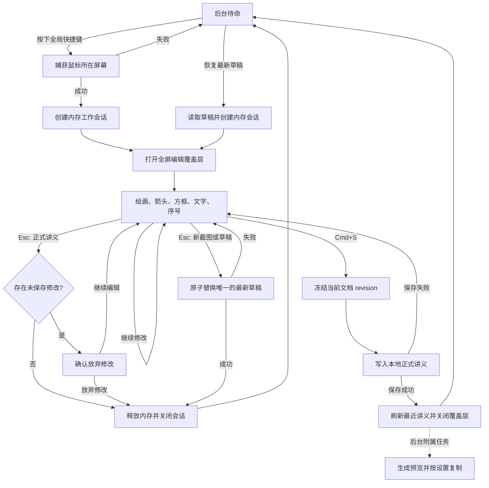

# RS Board MVP 实现方案

## 1. 主要流程

```text
新截图 -> 绘画、标记 -> 暂存并退出 / 保存
正式讲义 -> 读取到内存 -> 修改 -> 保存 / 放弃内存修改
最新草稿 -> 恢复到内存 -> 修改 -> 覆盖草稿 / 保存为正式讲义
```



流程阶段定义：

| 阶段 | 开始条件 | 结束条件 | 产生的数据 |
| --- | --- | --- | --- |
| 截图 | 收到全局快捷键 | 获得当前屏幕像素或返回错误 | `CaptureFrame` |
| 创建会话 | 截图成功 | 文档、背景纹理和命令历史就绪 | `WorkingSession` |
| 绘画、标记 | 全屏编辑器显示 | 用户根据会话来源选择退出或保存 | `BoardDocument` 的多个 revision |
| 暂存并退出 | 新截图或已恢复草稿收到 `StashAndExitRequested` | 最新草稿目录完成原子替换，内存会话释放 | `LatestDraft` |
| 关闭正式讲义 | 正式讲义收到 `CloseExistingDocumentRequested` | 无修改时直接关闭；有修改时确认放弃后关闭 | 不产生持久化数据 |
| 保存 | 收到 `SaveRequested` | 指定 revision 被可靠保存 | `SavedDocument` |
| 恢复草稿 | 收到 `RestoreLatestDraftRequested` | 最新草稿载入内存编辑器 | `WorkingSession` |

编辑期间的修改只存在内存中，不持续写入草稿或正式讲义。新截图和已恢复草稿按 `Esc` 时才把当前 revision 写入唯一草稿槽位；正式讲义按 `Esc` 不创建草稿，有未保存修改时确认后放弃内存修改，磁盘正式讲义保持不变。正式讲义只有收到 `Cmd+S` 且保存成功后才更新。应用崩溃或被系统终止时，尚未暂存或保存的内存修改会丢失。MVP 不为新截图提供直接永久丢弃入口，但允许从菜单栏或最近讲义界面确认删除健康草稿。

## 2. 流程中传递的数据

模块之间不共享零散可变状态，而是沿主流程传递以下对象。

### 2.1 `CaptureFrame`

由屏幕捕获模块生成，交给应用协调器：

```text
CaptureFrame
  request_id
  rgba_pixels
  pixel_size
  display_bounds_global
  scale_factor
  captured_at
```

它保存完整当前屏幕的原始像素及坐标信息。捕获热路径不编码 PNG，也不写磁盘。

### 2.2 `WorkingSession`

由应用协调器在截图成功后创建，贯穿整个编辑阶段：

```text
WorkingSession
  session_id
  origin: NewCapture | ExistingDocument | LatestDraft { generation_id }
  document: BoardDocument
  history: CommandHistory
  dirty
  element_clipboard: Optional<Element>
  background_source: CapturedPixels | StoredImage
  editor_state
  lifecycle: Editing | Stashing | Saving
```

业务上背景始终是第一次截到且不再变化的图片。新截图会以 `CapturedPixels` 携带原始 RGBA 像素供 UI 立即显示，首次暂存或保存时才编码为 `<document_id>.png`；重新打开正式讲义或最新草稿时使用各自目录中的 `StoredImage`，同时保留本会话已解码的背景像素，以便源目录在编辑期间丢失时仍可保存重建。生成快照时可在稳定文件仍存在时引用该文件，否则使用缓存像素。文档历史不复制背景像素。

`dirty` 表示当前正式讲义状态是否不同于打开时的内存基线，用于来源相关关闭确认；新截图和已恢复草稿的 `Esc` 行为不依赖它。`element_clipboard` 只在当前 `WorkingSession` 有效，关闭会话后释放。

### 2.3 `DocumentCommand`

全屏标注编辑器把一次完整操作转换成命令，再交给讲义文档和命令历史：

```text
AddElement
UpdateElement
MoveElement
DeleteElement
ChangeElementStyle
ResizeRectangle
UpdateArrowEndpoint
UpdateRectangleLabel
SetNextSequenceNumber
BringForward
SendBackward
BringToFront
SendToBack
```

命令执行成功后产生新的文档 revision，并触发重绘。编辑期间不触发磁盘写入。

### 2.4 `DocumentSnapshot`

本地存储、图片导出和后台任务只能接收指定 revision 的只读快照：

```text
DocumentSnapshot
  document_id
  title
  revision
  preview_revision: Optional
  canvas_size_px
  background_source: CapturedPixels | StoredImage
  elements
  next_sequence_number
```

快照隔离 UI 线程中的后续修改，防止后台任务读取到一半新、一半旧的文档状态。

### 2.5 `LatestDraft`

新截图或已恢复草稿按 `Esc` 后由本地存储模块生成：

```text
LatestDraft
  generation_id
  document_id
  revision
  directory_path
  manifest_path
```

`generation_id` 用于区分草稿槽位的不同版本。应用对外只暴露一个最新草稿，旧 generation 在新草稿原子提交后删除。

### 2.6 `SavedDocument`

正式保存完成后由本地存储模块返回：

```text
SavedDocument
  document_id
  revision
  manifest_path
  background_path
  preview_path: Optional
```

应用协调器收到它以后，才把本次操作判定为保存成功并刷新最近讲义。

## 3. 截图阶段

截图阶段的调用链：

```text
全局快捷键
  -> 平台适配发送 CaptureRequested
  -> 应用协调器进入 Capturing
  -> 屏幕捕获抓取鼠标所在屏幕
  -> 返回 CaptureFrame
  -> 应用协调器创建 WorkingSession
  -> 平台适配打开全屏编辑覆盖层
  -> 画布渲染器显示冻结屏幕
```

### 3.1 平台适配模块

首发版本只支持 macOS。在这一阶段负责：

- 注册可配置的逻辑 `F1` 全局快捷键并生成 `CaptureRequested`；媒体键模式下可能需要按 `Fn+F1`。
- 首次启动请求 macOS Screen Recording 权限；用户拒绝后，每次触发截图仍重新检查并尝试请求。
- 获取鼠标所在 NSScreen、全局边界、Retina scale factor 和多显示器布局。
- 在截图完成后创建 macOS 无边框、置顶的全屏覆盖窗口。
- 通过捕获 API 排除全部 RS Board 窗口，而不依赖窗口出现时序。
- 覆盖窗口只占目标显示器和当前 Space，不阻塞其他显示器。

输入是 macOS 系统事件，输出是应用内部事件和显示器信息。平台模块不创建业务文档。Windows/Linux 适配不进入 MVP。

### 3.2 应用协调器

收到 `CaptureRequested` 后：

1. 生成唯一 `request_id` 并进入 `Capturing`。
2. 忙碌状态下再次收到 `F1` 时忽略请求并显示 Toast，避免并发创建两个会话。
3. 调用屏幕捕获模块。
4. 校验返回结果的 `request_id` 是否仍然有效。
5. 捕获成功后创建 `BoardDocument` 和 `WorkingSession`。
6. 打开全屏编辑器并把 `WorkingSession` 交给它。

捕获失败时，协调器释放临时资源并回到 `Idle`。macOS 录屏权限缺失、显示器失效、超过 8K 上限和系统捕获错误使用不同错误类型。

### 3.3 屏幕捕获模块

输入：

- 触发时鼠标位置。
- 当前显示器信息。
- `request_id`。

执行：

1. 锁定鼠标所在显示器。
2. 抓取目标显示器在当前 Space 的完整像素，通过 API 排除全部 RS Board 窗口。
3. 记录物理像素尺寸、显示器全局边界和缩放比例。
4. 按设置决定是否包含光标，默认不包含。
5. 把像素规范化为 8-bit sRGB RGBA；横向或纵向超过 8K 时拒绝捕获。

输出的完整屏幕尺寸直接成为 `BoardDocument.canvas_size_px`，背景引用完整屏幕图片。

### 3.4 讲义文档模块

截图成功后创建初始文档：

```text
BoardDocument
  schema_version
  document_id
  title = "截图 YYYY-MM-DD HH:mm:ss"
  canvas_size_px
  background:
    kind = CapturedScreen
    file = "<document_id>.png"
    pixel_size
    captured_display
  preview_file = "<document_id>.preview.png"
  preview_revision: Optional
  elements[]
  next_sequence_number = 1
  revision = 0
  created_at
  updated_at
```

默认标题按 `CaptureFrame.captured_at` 生成“截图 YYYY-MM-DD HH:mm:ss”。此时文档只存在背景，没有标记元素，`preview_revision = None`。`preview_revision = Some(revision)` 仅表示磁盘预览已确认与该 revision 匹配；新 revision 保存时先恢复为 `None`，直到后台任务按条件确认。持久化文档从创建起就记录稳定的相对背景文件名和预览文件名，不保存运行期内存引用；实际背景像素由 `WorkingSession.background_source` 持有，首次暂存或保存前不写入磁盘。

## 4. 绘画、标记阶段

一次标记操作的循环：

```text
egui 输入
  -> 全屏标注编辑器更新临时工具状态
  -> 画布渲染器绘制临时预览
  -> 操作完成后生成 DocumentCommand
  -> 命令历史应用命令
  -> BoardDocument revision + 1
  -> 画布渲染器绘制已提交元素
```

### 4.1 全屏标注编辑器

打开后立即启用上次使用的工具；首次无历史时默认启用方框工具。全屏标注编辑器负责：

- 使用 `egui` 接收鼠标、键盘和输入法事件。
- 根据 `CaptureFrame` 的屏幕边界和缩放比例，把逻辑坐标转换成文档物理像素坐标。
- 管理当前工具、各工具分别记忆的颜色、线宽、字号和工具内部临时状态。
- 在操作进行中产生临时元素，交给画布渲染器预览。
- 在操作完成时产生一条或一组 `DocumentCommand`。
- 产生 `StashAndExitRequested`、`CloseExistingDocumentRequested` 和 `SaveRequested`，但不自行暂存或保存文档。

输入优先级：

1. 文字输入和输入法组合状态。
2. 正在进行的指针操作。
3. 临时修饰键。
4. 工具切换快捷键。
5. 撤销、重做、保存、复制粘贴和退出等会话命令。

`Esc` 先取消尚未提交的工具操作。没有进行中操作时，新截图或已恢复草稿触发“写入最新草稿并退出”；正式讲义无修改时直接关闭，有未保存修改时显示“放弃修改 / 继续编辑”，且任何一种情况都不创建草稿。

### 4.2 编辑开始交互

编辑器采用“画布优先”交互：鼠标默认留在画布区域，高频工具和样式切换通过键盘完成。工具栏常驻顶部居中，用于展示状态和提供备用点击入口，但不作为主操作路径。

顶部工具栏使用图标按钮并显示：

- 当前工具。
- 工具快捷键映射：`1` 选择、`2` 方框、`3` 箭头、`4` 文字、`5` 画笔、`6` 序号。
- 当前颜色和线宽。
- 撤销、重做和保存按钮，行为分别与 `Cmd+Z`、`Cmd+Shift+Z` 和 `Cmd+S` 一致。
- 当前保存、暂存并退出或草稿写入状态。

非文字编辑状态的快捷键：

| 快捷键 | 行为 |
| --- | --- |
| `1` / `Cmd+1` | 切换到选择工具 |
| `2` / `Cmd+2` | 切换到方框工具 |
| `3` / `Cmd+3` | 切换到箭头工具 |
| `4` / `Cmd+4` | 切换到文字工具 |
| `5` / `Cmd+5` | 切换到画笔工具 |
| `6` / `Cmd+6` | 切换到序号工具 |
| `Cmd+Z` | 撤销 |
| `Cmd+Shift+Z` | 重做 |
| `Cmd+S` | 保存并在正式提交成功后关闭编辑器 |
| `Cmd+C` / `Cmd+V` | 复制或粘贴当前单个选中元素 |
| `Backspace` / `Delete` | 删除当前选中元素 |
| 按住 `Option` | 在鼠标附近显示样式与元素操作面板 |

文字或方框书签浮标编辑状态：

- 普通数字和字母都输入到文本，不触发工具切换。
- `Enter` 提交当前文字并失焦。
- `Shift+Enter` 或 `Cmd+Enter` 在当前文字中插入换行，不提交文字。
- `Cmd+1` 到 `Cmd+6` 先提交当前文字、自动失焦，再切换到对应工具。
- `Cmd+S` 先提交输入法组合和有效文字，再保存；空白的新文字不创建元素或 revision。
- `Cmd+C` / `Cmd+V` 优先交给系统文字编辑；只有退出文字编辑后才操作元素剪贴板。
- `Backspace` / `Delete` 删除文本字符，不删除元素。
- `Esc` 取消当前文字编辑或退出文字状态。新建的独立文字为空时取消创建；新方框退出标签编辑时仍保留方框和默认“标题”。只有文本已失焦后再次 `Esc` 才执行来源对应的关闭流程。
- `Option` 样式面板不在文字编辑状态出现，避免干扰 macOS 文本输入。

`Option` 样式面板规则：

- 只在非文字编辑状态生效。
- 按住 `Option` 显示，松开关闭。
- 面板出现在鼠标附近，并自动保持在屏幕内。
- 用户用鼠标选择颜色、线宽和适用工具的字号，点击后立即应用；面板保持到 `Option` 松开。
- 选中元素时显示上移、下移、置顶、置底按钮，点击后生成可撤销的图层命令。
- 序号工具时显示下一个数字和插入按钮；点击后在面板打开时的鼠标位置插入序号。

样式采用固定预设：

- 颜色为红 `#FF3B30`、黄 `#FFD60A`、绿 `#30D158`、蓝 `#0A84FF`、白和黑，默认红色。
- 线宽为 `4px`、`8px`、`12px`，默认 `8px`。
- 字号为 `12px`、`16px`、`24px`、`36px`、`48px`、`64px`，默认 `24px`。
- 各工具分别记忆自己的样式；修改样式时优先更新选中元素，没有选中元素时更新当前工具默认值。
- 内置并固定使用 `Noto Sans CJK SC Regular`，不提供字体或字重选择。所有元素固定完全不透明。

### 4.3 工具与命令

| 工具 | 编辑器中的临时状态 | 完成后提交的命令 |
| --- | --- | --- |
| 选择 | 命中控制点、命中元素本体、拖动偏移、变换预览 | `MoveElement`、`ResizeRectangle`、`UpdateArrowEndpoint`、`DeleteElement`、`ChangeElementStyle`、图层命令 |
| 方框 | 起点、当前终点；松开后进入书签浮标文字编辑 | `AddElement(Rectangle)` 后接 `UpdateRectangleLabel` |
| 箭头 | 起点、当前终点和箭头头部预览 | `AddElement(Arrow)` |
| 文字 | 锚点、组合输入状态、当前字符串 | `AddElement(Text)` 或 `UpdateElement` |
| 画笔 | 当前采样点列表 | `AddElement(Stroke)` |
| 序号 | 当前指针位置 | `AddElement(SequenceMarker)` 和序号推进 |

方框工具的特殊行为：用户拖动完成后，系统自动在方框边缘创建一个书签浮标，默认文字为“标题”，并立即聚焦该文字；默认文字处于选中状态，用户直接输入即可替换。退出标签编辑而没有输入时保留默认“标题”。浮标优先显示在方框上方，如果上方空间不足以容纳浮标高度和安全边距，则显示在方框下方。浮标属于方框元素的一部分，不作为独立 `Text` 元素存在。

箭头工具拖动时实时预览线段和箭头头部，松开后提交。箭头样式沿用当前颜色和线宽；箭头头部尺寸由线宽推导，并设置最小箭头长度。低于最小可读长度时显示无效预览，松开后取消，不产生命令、元素或新 revision。

选择工具的移动与自由变换规则：

- 鼠标按下时先命中控制点，再命中元素本体。
- MVP 只允许单选。命中控制点进入自由变换；命中元素本体进入移动；命中空白清除选中；元素重叠时选择 `z_index` 最高的可命中元素。
- 双击已有独立文字或方框标签进入文字编辑。
- 控制点命中区域大于视觉点，保证拖拽容易命中。
- 方框选中后显示 8 个控制点；拖动角点或边点缩放方框本体。
- 方框书签浮标和浮标文字不随方框缩放；浮标按新的方框位置重新计算上方或下方布局，文字大小只由字号决定，超出最大宽度时自动换行。
- 箭头选中后只显示起点和终点 2 个控制点；拖动起点或终点改变箭头几何。
- 文字、序号和画笔不显示自由变换控制点，只支持拖动整体移动。
- MVP 不使用修饰键区分移动和变换，避免与 `Option` 样式面板和文字输入冲突。

元素复制粘贴只在同一工作会话内保留一个元素副本。粘贴时生成新 `element_id`，把元素中心放到当前鼠标位置，将整体约束到画布内，置于最上层并自动选中；不支持跨讲义复制，也不提供 `Cmd+D`。

画笔绘制过程中以完全不透明样式显示当前采样点，松开后原样持久化，不执行距离过滤、抽稀、平滑或其他几何调整。单击画布创建一个直径等于当前线宽的圆点。方框、箭头和多点画笔的最小有效几何阈值由当前线宽确定；不满足阈值的拖动操作不产生命令、元素或 revision。

### 4.4 讲义文档与命令历史

MVP 的讲义固定为单页。讲义文档持久化的是最终可编辑状态，不保存运行时选中态、鼠标悬停态、临时拖拽预览或 undo/redo 栈。

```text
BoardDocument
  schema_version
  document_id
  title
  canvas_size_px
  background:
    kind = CapturedScreen
    file = "<document_id>.png"
    pixel_size
    captured_display:
      global_bounds_px
      scale_factor
  preview_file = "<document_id>.preview.png"
  preview_revision: Optional
  elements[]
  next_sequence_number
  revision
  created_at
  updated_at
```

元素通用字段：

```text
Element
  element_id
  z_index
  bounds_px
  kind
  payload
```

- `element_id` 在同一文档内唯一，用于选择、命令历史和序列化往返。
- `z_index` 决定渲染顺序，后创建元素默认在上层。
- `bounds_px` 使用文档物理像素坐标，包含元素主体和可见附属物；不包含控制点命中区域。
- `payload` 按元素类型保存可编辑几何与样式。

通用样式结构：

```text
StrokeStyle
  color_rgba
  width_px
  opacity
  line_cap = Round | Square | Butt
  line_join = Round | Miter | Bevel

TextStyle
  color_rgba
  font_family
  font_size_px
  line_height_px
  align = Left | Center | Right
```

MVP 默认 `line_cap = Round`、`line_join = Round`。颜色统一保存为 RGBA，尺寸统一保存为文档物理像素。透明度固定为 `1.0`，文字的 `font_family` 固定为内置 `Noto Sans CJK SC Regular`。

具体元素 payload：

```text
StrokePayload
  points[]:
    x_px
    y_px
    pressure = 1.0
  stroke_style
```

- `points` 原样保存绘制时采集的物理像素点，至少包含一个点；单点表示直径等于线宽的圆点。
- MVP 不使用压感，但保留 `pressure` 字段，默认 `1.0`。

```text
ArrowPayload
  start_px
  end_px
  stroke_style
  head:
    length_px
    width_px
    min_body_length_px
```

- 箭头保存几何参数，不保存栅格化结果。
- 起点和终点是可编辑控制点；移动、删除、撤销和重做按单个元素处理。

```text
RectanglePayload
  start_px
  end_px
  stroke_style
  fill_rgba = None
  label:
    text = "标题"
    placement_preference = Above
    max_width_px
    padding_px
    anchor_offset_px
    text_style
```

- 方框本体支持缩放；`start_px` 和 `end_px` 可由控制点拖动更新。
- `fill_rgba = None`，MVP 方框默认无填充。
- 书签浮标是方框 payload 的绑定子结构，不是独立 `Text` 元素。
- 浮标背景使用方框颜色，文字颜色按对比度自动选择黑或白。
- 浮标最大宽度为方框宽度的 `1.5` 倍且不超过画布宽度；内容超出时自动换行。
- 最终 `Above | Below` 位置不持久化，由屏幕预览和最终图片共用的布局函数根据方框、画布和文本尺寸派生。

```text
TextPayload
  anchor_px
  text
  box_width_px
  text_style
```

- `text` 保存用户输入的原始文本，包括用户主动输入的换行。
- MVP 不做自由缩放；文字大小只由 `font_size_px` 决定。
- 独立文字按画布约束自动换行，并持久化排版后确定的 `box_width_px`，确保重开与导出一致。

```text
SequenceMarkerPayload
  center_px
  number
  radius_px
  pill_width_px
  fill_rgba
  stroke_style
  text_style
```

- `number` 是创建时固定的显示数字，删除其他序号不会重排。
- 序号使用当前颜色的实色背景，数字颜色按对比度自动选择黑或白。
- `number` 不可编辑。MVP 不做自由缩放；单个数字显示为圆形，多位数字放不进圆形时只增加宽度并扩展为胶囊。

命令历史负责：

- 应用文档命令并维护 undo、redo 栈。
- 新命令执行后清空 redo 栈。
- 撤销和重做同样产生新的 revision。
- 把连续拖动合并为一条最终移动命令。
- 把方框控制点拖动合并为一条最终 `ResizeRectangle` 命令。
- 把箭头端点拖动合并为一条最终 `UpdateArrowEndpoint` 命令。
- 把连续文字输入合并成一次文本修改；方框书签浮标文字同样按一次标签修改处理。
- 添加序号时推进计数器，撤销时恢复计数器。
- 图层上移、下移、置顶和置底各自作为一条命令进入历史。
- 同一会话内复制不修改文档；粘贴作为一条新增元素命令进入历史。
- undo/redo 合计最多保留 500 条或估算 256MB 的命令数据，达到任一上限时从最旧记录开始淘汰。

删除已有序号不会重排其他序号。undo、redo 栈只属于当前内存工作会话，不写入正式讲义或 `draft/latest/`。

文档模块硬性限制单页最多 10,000 个元素和累计 1,000,000 个持久化画笔点。达到限制后拒绝会继续超限的新增或粘贴命令，保持 document 和 revision 不变并显示提示；打开、恢复、导入和保存前也执行同一校验。

### 4.5 画布渲染器

编辑阶段从下到上绘制：

1. 完整屏幕背景纹理。
2. 已提交的文档元素。
3. 编辑器提供的临时元素。
4. 选择框、命中提示和控制点。
5. 工具栏与会话状态。

文档内部统一使用截图物理像素坐标。渲染器持有 `DocumentTransform`，负责物理像素、`egui` 逻辑点和当前显示区域之间的转换。

重开正式讲义或草稿时，覆盖窗口在鼠标所在屏幕打开，画布按原始宽高比完整缩放并居中，剩余区域留黑。留黑区不接受任何文档输入，最终 PNG 始终使用原始 `canvas_size_px`，不把留黑区域写入导出。

背景纹理只在创建会话、重新打开讲义或 GPU 纹理失效时上传。画笔移动期间直接显示原始采样点，不能等待路径优化或磁盘写入。

方框书签浮标渲染规则：

- 浮标与方框一起绘制、命中、移动、删除和撤销。
- 浮标默认贴近方框上边缘，并留出固定安全边距。
- 如果 `rect.top - label_height - margin < 0`，则显示在方框下方。
- 如果下方仍不足，浮标保持在画布内并贴近可用边界。
- 浮标宽度不超过方框宽度的 `1.5` 倍和画布宽度；文字超出时使用固定字体自动换行。
- 方框缩放后，浮标重新按新方框位置布局，但浮标尺寸和文字字号不随方框比例缩放。
- 浮标文本编辑期间，输入法和普通字符优先于工具快捷键。
- 预览、保存后的 PNG、`<document_id>.preview.png` 和 `.rsboard` 重开后的渲染位置必须一致。

箭头渲染规则：

- 箭头主体从起点指向终点，箭头头部在终点。
- 选中箭头时，起点和终点控制点显示在箭头两端；拖动控制点实时更新预览。
- 箭头头部尺寸根据线宽计算，并设置上限和下限。
- 箭头长度低于最小可读长度时显示无效预览，松开后不提交元素，也不增加 revision。
- 预览、保存后的 PNG、`<document_id>.preview.png` 和 `.rsboard` 重开后的箭头位置与头部形状必须一致。

选择控制点渲染规则：

- 选中方框显示 8 个控制点：四角和四边中点。
- 选中箭头显示 2 个控制点：起点和终点。
- 选中文字、序号和画笔时只显示选中框或命中提示，不显示缩放控制点。
- 控制点视觉半径可以较小，但命中半径必须更大；命中测试优先级高于元素本体。

画布边界规则：

- 方框、箭头、画笔和序号在创建、移动、变换和粘贴后必须完整位于画布内。
- 独立文字和方框标签允许部分超出画布；屏幕预览、预览图和最终导出都在画布边界统一裁切。
- 最小图形阈值由线宽派生；短箭头和其他不满足阈值的图形在松开后不产生命令、元素或 revision。

### 4.6 内存生命周期

- `BoardDocument`、undo/redo 栈、临时元素和 `background_source` 全部由 `WorkingSession` 持有；新截图会话的背景来源包含 RGBA 像素，重开会话的背景来源指向稳定图片文件。
- 编辑期间不编码背景 PNG、不写 `.rsboard` 元数据，也不创建讲义目录。
- 文档 revision 只用于命令顺序、撤销重做，以及暂存或保存时冻结一致快照。
- 重新打开正式讲义或恢复最新草稿后，后续修改同样只保留在内存。
- 新截图或已恢复草稿按 `Esc` 时创建当前 revision 的快照并覆盖唯一最新草稿；正式讲义按 `Esc` 不写草稿。
- 应用异常退出时，最后一次按 `Esc` 产生的草稿仍可恢复；此后尚未暂存或保存的修改会丢失。

## 5. 暂存并退出分支

暂存并退出只适用于 `NewCapture` 和 `LatestDraft { generation_id }`。用户在编辑器中按 `Esc` 的流程：

```text
StashAndExitRequested
  -> 应用协调器进入 Stashing
  -> 全屏标注编辑器停止接收修改
  -> 冻结当前 revision 的 DocumentSnapshot
  -> 本地存储写入 draft/.tmp-<generation_id>/
  -> 原子替换唯一的 draft/latest/
  -> 返回 LatestDraft
  -> 释放 BoardDocument、CommandHistory 和截图像素
  -> 画布渲染器释放背景纹理
  -> 平台适配关闭覆盖层
  -> 应用协调器回到 Idle
```

### 5.1 应用协调器

- 仅允许新截图和已恢复草稿进入 `Stashing`；正式讲义使用第 5.5 节关闭流程。
- 暂存开始后拒绝新的文档命令和保存请求。
- 冻结当前 revision 并生成 `DocumentSnapshot`。
- 请求本地存储执行 `ReplaceLatestDraft`。
- 收到匹配 generation 和 revision 的 `LatestDraft` 后，从协调器移除当前 `WorkingSession`。
- 通知渲染器和平台窗口释放当前会话资源。
- 交互式暂存写入失败时回到 `Editing`，保留完整内存会话，显示持久错误条和重试按钮；不能静默丢弃。

### 5.2 本地存储与后台任务

1. 为这次暂存生成新的 `generation_id`。
2. 创建 `draft/.tmp-<generation_id>/`，写入 `<document_id>.rsboard` 和 `<document_id>.png`；预览文件不是提交草稿的必要条件。
3. `.rsboard` 记录背景和预览的相对文件名；预览文件本身可以缺失。草稿 generation 属于槽位元信息，不建模为正式讲义来源。
4. 必需文件完整写入并校验成功后，原子替换 `draft/latest/`；替换成功后删除旧目录。
5. 返回 `LatestDraft { generation_id, document_id, revision, directory_path, manifest_path }`。

`draft/latest/` 是单一逻辑槽位。写入过程中可以短暂存在一个 `.tmp-<generation_id>` 目录，但新草稿提交后旧目录立即被删除，对用户始终只暴露一个草稿。

### 5.3 画布渲染器与平台适配

- 渲染器释放截图纹理和临时元素。
- 平台适配仅在收到匹配的 `LatestDraft` 后关闭全屏覆盖窗口并恢复后台快捷键监听。
- 草稿写入期间覆盖窗口保持冻结且不再接收编辑输入。
- 收到 `LatestDraft` 后释放资源并关闭窗口；写入失败则恢复原编辑画面和输入状态。

### 5.4 恢复最新草稿

```text
RestoreLatestDraftRequested
  -> 本地存储读取 draft/latest/
  -> 校验 schema、.rsboard 元数据和必需背景
  -> 创建 origin = LatestDraft { generation_id } 的 WorkingSession
  -> 画布渲染器上传背景纹理
  -> 全屏标注编辑器继续编辑
```

- 菜单栏状态项和最近讲义界面提供“恢复最新草稿”入口；没有草稿时该入口禁用。
- 恢复操作本身不删除 `draft/latest/`，避免打开后立即崩溃造成草稿丢失。
- 恢复后再次按 `Esc`，用当前 revision 覆盖同一个草稿槽位。
- 恢复后成功保存为正式讲义时，只有当前 `generation_id` 仍是最新草稿才删除它。
- 草稿损坏时显示不可恢复状态，并允许用户删除损坏草稿。

### 5.5 正式讲义关闭与应用退出

正式讲义与草稿完全独立：

- 正式讲义会话按 `Esc` 时，若 `dirty = false` 则直接关闭；若 `dirty = true` 则显示“放弃修改 / 继续编辑”。选择放弃只丢弃内存修改，不写入或删除 `draft/latest/`。
- 退出整个应用且正式讲义有未保存修改时，显示“保存并退出 / 不保存并退出 / 取消”。保存失败时取消退出并返回编辑器；不保存则丢弃内存修改后退出。
- 退出整个应用且会话来自新截图或最新草稿时，执行一次尽力暂存。暂存失败需要记录错误并显示退出提示，但仍释放会话并退出。
- 应用处于 `Saving` 或 `Stashing` 时收到退出请求，先等待背景与 `.rsboard` 等必需提交完成，再按结果继续退出；预览和剪贴板任务立即取消，不阻止退出。
- 编辑器失焦时保留工作会话、选中态和未提交内容，但暂停接收文档输入；重新获得焦点后继续。
- 显示器断开或分辨率变化时，把当前会话迁移到可用屏幕并重新计算完整适配，不修改文档坐标和原始画布尺寸。

## 6. 保存分支

保存流程：

```text
SaveRequested
  -> Cmd+S 或工具栏保存按钮
  -> 全屏标注编辑器提交输入法组合、有效文字或临时标记
  -> 应用协调器进入 Saving 并冻结目标 revision
  -> 本地存储创建正式讲义临时目录
  -> 编码背景并写入该 revision 的 .rsboard 元数据
  -> 临时目录原子改名为 documents/<document_id>
  -> 返回 SavedDocument
  -> 如果会话来自最新草稿，清除匹配 generation 的草稿
  -> 最近讲义加入或更新条目
  -> 关闭覆盖层并回到 Idle
  -> 后台生成预览图并按设置复制 PNG 与 TIFF/NSImage 到剪贴板
```

### 6.1 全屏标注编辑器

收到保存操作时：

- 完成有效的文字输入并提交文本命令。
- 先结束输入法组合；输入法和有效文字提交完成后才冻结保存 revision。
- 提交已经形成有效几何形状的临时标记。
- 取消空白新文字和没有达到当前线宽最小阈值的图形，不产生额外 revision。
- 向协调器发送最终 `SaveRequested`。

编辑器不能在保存过程中继续修改已冻结 revision。

### 6.2 应用协调器

1. 进入 `Saving { document_id, revision }`。
2. 生成目标 revision 的 `DocumentSnapshot`。
3. 请求本地存储执行正式保存。
4. 把目标 revision 的 `preview_revision` 标记为待生成；同时可以把独立快照交给渲染器生成压平图片，但正式保存不依赖预览或剪贴板成功。
5. 收到匹配 revision 的 `SavedDocument` 后确认保存成功。
6. 如果 `WorkingSession.origin = LatestDraft { generation_id }`，请求删除仍与该 generation 匹配的最新草稿。
7. 通知最近讲义刷新并关闭编辑会话；后台预览和剪贴板任务继续持有自己的只读快照。

如果正式数据提交失败，协调器回到 `Editing` 并保留完整内存会话，允许用户重试。预览或剪贴板失败只显示可恢复提示，不回滚已经保存的正式讲义，也不恢复已关闭的编辑会话。

所有来源保存成功后都关闭编辑器。普通新会话或已有正式讲义保存成功时，不修改现有的 `draft/latest/`；只有从该草稿恢复的会话保存成功后，才清除匹配 generation 的草稿。

### 6.3 本地存储

正式保存按以下顺序执行：

1. 新讲义创建 `documents/.tmp-<document_id>` 临时目录；从正式讲义打开但源目录已丢失时，也使用原 `document_id` 按新讲义流程重建。
2. 新截图把内存像素编码为 `<document_id>.png`；草稿保存复用已校验的背景，正式讲义源目录丢失时使用会话缓存像素重建同名背景。
3. 将目标 revision 序列化为 `<document_id>.rsboard`；其中记录背景文件名和预览文件名。
4. 背景与 `.rsboard` 全部写入并校验成功后，把临时目录原子改名为 `documents/<document_id>`。
5. 重新打开的讲义先校验必需背景仍存在，缺失时从会话缓存像素恢复，再写入 `<document_id>.rsboard.tmp` 并原子替换正式 `.rsboard`；不可变背景通常直接复用。即使磁盘 revision 在会话期间被外部修改，也明确以当前会话 revision 覆盖。
6. 返回 `SavedDocument`，此时正式保存已经成功。
7. 后台按长边 `480px`、保持宽高比且不裁剪的规则生成 `<document_id>.preview.png`，先写临时文件再原子替换。
8. 仅当磁盘文档 revision 仍等于该后台任务的目标 revision 时，原子更新 `.rsboard` 中的 `preview_revision`；否则丢弃迟到结果并为新 revision 重新排队。

第 1 至 5 步中的正式数据提交失败时，删除本次临时输出并保留 UI 线程中的 `WorkingSession`。未完成的临时输出不会出现在最近讲义中。第 7 或第 8 步失败时保留已经保存的讲义；预览缺失或 `preview_revision != revision` 时显示占位图并后台重建。

正式讲义不会自动删除。只有用户从最近讲义确认后才永久删除整个文档目录，且不联动草稿。

### 6.4 画布渲染器与剪贴板、导出

最终图片只渲染：

1. 完整屏幕背景。
2. 保存 revision 中已提交的元素。

最终图片不包含工具栏、光标、选择框和临时状态，尺寸固定为 `canvas_size_px`。

同一套元素几何、颜色、线宽、字体和序号布局规则必须同时用于屏幕预览和最终图片。最终图片统一为 8-bit sRGB RGBA，可以：

- 根据设置写入系统剪贴板。
- 编码并导出 PNG。
- 生成最近讲义使用的 `<document_id>.preview.png`。

剪贴板同时声明 PNG 与 TIFF/NSImage 表示。PNG 编码和文件写入由后台任务完成，不阻塞 `egui` 更新。

导出 PNG 和讲义文件组使用清理后的标题作为文件基名。遇到同名时，整组统一追加 `-2`、`-3` 等后缀；导出讲义文件组时复制 `.rsboard`、必需背景和已有预览，并改写导出副本中的相对资源文件名。本地正式讲义始终以 `document_id` 命名，不因重命名标题而改名。

### 6.5 最近讲义

最近讲义使用自适应网格，条目按 `updated_at` 降序排列。每个条目在固定 `16:9` 的留黑框中等比完整显示预览，不裁剪，并显示标题与更新时间。标题搜索即时过滤当前列表。

- 双击标题或使用更多菜单重命名；重命名只原子更新 `.rsboard` 的 `title`，本地目录和文件名保持 document ID。
- 更多菜单包含重命名、复制图片、导出 PNG、导出讲义和删除。
- 删除正式讲义必须确认，确认后永久删除整个目录，不影响 `draft/latest/`。
- 预览缺失或过期时显示占位图并请求后台重建；单个损坏或不兼容文档只影响自己的条目。
- 最近讲义界面显示独立的“恢复最新草稿”入口。健康草稿可以单独确认删除，草稿不混入正式讲义排序。
- 编辑期间仍可浏览最近讲义，但打开正式讲义和恢复草稿入口禁用，避免同时存在两个工作会话。

Finder 双击和拖放 `.rsboard` 都触发导入。导入成功后把条目置顶并高亮，不自动打开编辑器；失败在最近讲义窗口显示可操作错误。若应用已运行，第二进程只把文件打开请求转交给现有实例后退出。

## 7. 应用状态机

```text
Idle
  -> Capturing
       -> Editing
            -> Stashing -> Idle                  # 仅新截图或已恢复草稿
            -> Stashing 失败 -> Editing           # 交互式 Esc
            -> ConfirmingDiscard -> Idle/Editing # 仅有修改的正式讲义
            -> Saving -> Idle
            -> Saving 失败 -> Editing
  -> OpeningDocument -> Editing
  -> RestoringDraft -> Editing
```

| 当前状态 | 接收的事件 | 调用的模块 | 下一状态 |
| --- | --- | --- | --- |
| `Idle` | `CaptureRequested` | 屏幕捕获 | `Capturing` |
| `Capturing` | `CaptureSucceeded` | 讲义文档、平台窗口、渲染器 | `Editing` |
| `Capturing` | `CaptureFailed` | 平台错误提示 | `Idle` |
| `Editing` | `DocumentCommand` | 命令历史、渲染器 | `Editing` |
| `Editing(NewCapture/LatestDraft)` | `StashAndExitRequested` | 协调器、本地存储、后台任务 | `Stashing` |
| `Stashing` | `LatestDraftStored` | 渲染器、平台窗口 | `Idle` |
| `Stashing` | `LatestDraftFailed` | 编辑器错误状态 | `Editing` |
| `Editing(ExistingDocument, clean)` | `CloseExistingDocumentRequested` | 平台窗口 | `Idle` |
| `Editing(ExistingDocument, dirty)` | `CloseExistingDocumentRequested` | 放弃修改确认框 | `ConfirmingDiscard` |
| `ConfirmingDiscard` | `DiscardChangesConfirmed` | 渲染器、平台窗口 | `Idle` |
| `ConfirmingDiscard` | `ContinueEditing` | 编辑器 | `Editing` |
| `Editing` | `SaveRequested` | 本地存储、渲染器、剪贴板 | `Saving` |
| `Saving` | `SaveSucceeded` | 最近讲义、平台窗口 | `Idle` |
| `Saving` | `SaveFailed` | 编辑器错误状态 | `Editing` |
| `Idle` | `OpenDocumentRequested` | 本地存储 | `OpeningDocument` |
| `OpeningDocument` | `DocumentOpened` | 编辑器、渲染器 | `Editing` |
| `OpeningDocument` | `DocumentOpenFailed` | 最近讲义错误提示 | `Idle` |
| `Idle` | `RestoreLatestDraftRequested` | 本地存储 | `RestoringDraft` |
| `RestoringDraft` | `LatestDraftOpened` | 编辑器、渲染器 | `Editing` |
| `RestoringDraft` | `LatestDraftFailed` | 草稿错误提示 | `Idle` |
| `Idle/Editing` | `ImportDocumentRequested` | 后台本地存储、安全校验 | 保持当前状态 |
| `Idle/Editing` | `ImportSucceeded/ImportFailed` | 最近讲义、错误提示 | 保持当前状态 |

应用协调器是唯一可以切换应用级状态的模块。其他模块只能产生事件或返回结果，不能自行替换工作会话。应用退出是状态机的上层终止请求：`Saving` 或 `Stashing` 等待必需提交，其他来源按第 5.5 节处理；预览和剪贴板等附属任务不参与退出屏障。

## 8. 模块在流程中的职责

| 模块 | 截图 | 绘画、标记 | 暂存并退出 | 保存 | 恢复草稿 |
| --- | --- | --- | --- | --- | --- |
| 应用协调器 | 创建请求和工作会话 | 分发命令与结果 | 冻结 revision 并协调草稿替换 | 冻结 revision 并协调正式保存 | 从草稿创建工作会话 |
| 平台适配 | 快捷键、权限、显示器、Space、覆盖窗口 | 维持全屏窗口并处理显示变化 | 草稿提交成功后关闭覆盖窗口 | 正式提交完成后关闭覆盖窗口 | 提供恢复入口并打开覆盖窗口 |
| 屏幕捕获 | 生成 `CaptureFrame` | 不参与 | 不参与 | 不参与 | 不参与 |
| 全屏标注编辑器 | 接收工作会话 | 管理工具状态并生成命令 | 生成暂存并退出事件 | 提交临时状态并生成保存事件 | 接收恢复的工作会话 |
| 讲义文档 | 创建 revision 0 | 保存元素与当前 revision | 生成目标 revision 快照 | 生成目标 revision 快照 | 反序列化草稿文档 |
| 命令历史 | 创建空历史 | 应用、撤销、重做、图层与粘贴命令，执行 500 条/256MB 淘汰 | 草稿成功后丢弃历史 | 提交保存前最后命令 | 创建空历史 |
| 画布渲染器 | 上传完整屏幕纹理 | 绘制文档和临时元素 | 草稿成功后释放纹理 | 生成压平图片和预览 | 上传草稿背景纹理 |
| 本地存储 | 不参与 | 不参与 | 原子覆盖 `draft/latest/` | 创建或更新正式讲义 | 读取并校验 `draft/latest/` |
| 剪贴板与导出 | 不参与 | 管理同会话单元素剪贴板 | 不参与 | 复制 PNG 与 TIFF/NSImage；按标题导出 PNG 或讲义文件组 | 不参与 |
| 最近讲义 | 不参与 | 可浏览但禁用打开和恢复 | 刷新草稿入口状态 | 接收 `SavedDocument` 并刷新网格、搜索和更多菜单 | 提供独立恢复与删除入口 |
| 设置 | 提供全局快捷键、光标和登录项选项 | 提供并分别记住各工具样式 | 保存设置 | 提供保存后复制偏好 | 不参与 |
| 后台任务 | 不参与 | 不参与 | 编码并替换最新草稿目录 | 编码背景，写正式讲义、压平图片和预览 | 读取并校验草稿文件组 |

## 9. 本地存储结构

```text
app_data/
  settings.json
  draft/
    latest/
      <document_id>.rsboard
      <document_id>.png
      <document_id>.preview.png  # 可选
  documents/
    <document_id>/
      <document_id>.rsboard
      <document_id>.png
      <document_id>.preview.png  # 可选
```

规则：

- 应用数据目录由 macOS 平台适配模块提供，使用用户级应用数据目录，不写入程序目录。
- `draft/latest/` 是唯一可恢复草稿，只在新截图或已恢复草稿按 `Esc` 时写入；正式讲义不会写入这里。
- 新草稿先写入 `draft/.tmp-<generation_id>/`，必需文件校验成功后原子替换 `draft/latest/`。
- 新草稿替换成功后，不保留任何更早草稿版本。
- 正式讲义和草稿使用相同的内部文件集合与加载流程；背景和 `.rsboard` 必须存在，预览可以缺失并后台重建。
- 三个文件都以不可变 `document_id` 为基名。`.rsboard` 保存背景和预览的相对文件名，目录移动后不需要重写引用。
- `.rsboard` 是 UTF-8 JSON，从第一版包含 `schema_version`、`title`、`revision` 和 `preview_revision`，并且不保存运行期绝对路径或内存引用。
- 新讲义在首次保存时编码一次 `<document_id>.png`，后续保存只更新 `.rsboard` 和可选预览。
- 新讲义先写入 `documents/.tmp-<document_id>`，完成后原子改名；既有讲义通过临时 `.rsboard` 加原子替换更新。
- 应用启动时检查上次保存或草稿替换中断留下的 `.tmp-*`：只有带完整提交标记、通过校验且目标目录缺失的临时目录可以完成提交，其他临时输出一律不暴露为讲义并安全清理。
- 设置使用临时文件加原子替换。
- 最近讲义通过扫描 `documents` 的 `.rsboard` 构建，MVP 不引入数据库。
- 核心流程不需要账号或网络服务。

`.rsboard` 只能引用同目录的普通文件名。解析时拒绝绝对路径、包含父目录或子目录分隔符的路径、符号链接和非普通文件；背景必须存在，预览允许缺失。导入还要校验 schema 版本、图片解码后的像素尺寸、8-bit sRGB RGBA 规范和资源上限，再生成新的本地 `document_id`、重命名文件并更新相对引用。横向或纵向超过 8K、元素超过 10,000 个或累计画笔点超过 1,000,000 个的讲义拒绝导入。

导出时把 `.rsboard`、必需背景和已有预览复制到用户选择的同一目录，整组使用清理后的标题和一致的重名后缀，并改写导出副本资源引用。导入和导出永远不让用户选取或修改应用管理的 `documents/` 内部目录。

## 10. 并发与一致性

- `egui` 更新、工具输入、文档命令和屏幕绘制在 UI 线程执行。
- 截图完成到新截图/草稿选择 `Esc` 暂存并退出或任意来源保存之前，不启动讲义文件写入任务；正式讲义按 `Esc` 不写磁盘。
- 暂存阶段写入完整草稿文件组并原子替换最新草稿目录；保存阶段编码背景、写入 `.rsboard` 并提交正式讲义。
- 所有后台结果携带 `request_id`；文档结果额外携带 `document_id` 和 `revision`。
- 编辑会话只接收当前 session 的结果，迟到的旧 session 结果直接丢弃。
- 暂存以 `LatestDraft` 返回为成功边界；任务仅进入队列不算草稿目录已经替换。
- 保存以 `SavedDocument` 返回为成功边界；仅进入任务队列不算保存成功。
- 保存已恢复草稿后，只有磁盘上的 generation 仍与会话匹配才清除草稿，防止删除更新的草稿。
- 保存期间不再接受新的文档命令；保存失败后回到原内存会话。
- 正式讲义保存不做乐观并发拒绝：外部 revision 变化时，以已冻结的当前会话快照覆盖；源目录丢失时使用原 document ID 重建。
- 预览任务以目标 revision 为条件更新 `preview_revision`；迟到任务不得把旧预览标记为当前。
- 退出屏障只等待背景和 `.rsboard` 的必要原子提交，立即取消预览和剪贴板任务。
- 应用退出或崩溃时，最近一次成功提交的 `draft/latest/` 保留；当前内存中更晚的修改会丢失。
- 后台任务完成后通过事件通道唤醒 `egui`，不固定频率轮询。

## 11. 平台、设置与发布约束

- 应用显示名称为 `RS Board`，Bundle ID 为 `com.linjiajian.rs-board`；最低支持 macOS 13，仅构建 Apple Silicon，界面只提供简体中文。
- 应用只显示菜单栏状态项，不显示 Dock 图标；启动后在后台待命，不自动打开最近讲义或编辑器。
- 默认全局快捷键是逻辑 `F1`。注册冲突时显示提示并允许用户修改；媒体键模式由系统决定是否需要 `Fn+F1`。
- 应用保持单实例。Finder 文件打开请求由第二进程转交已有实例；第二次普通启动只提示“应用已运行”后退出。
- 设置包含全局快捷键、截图是否包含光标、登录时启动和保存后复制图片。光标与登录项默认关闭，保存后复制默认开启。
- 设置提供双重确认的“清除所有讲义和草稿”，确认后永久删除应用管理的 `documents/` 和 `draft/latest/`；单独删除正式讲义或健康草稿使用一次确认。
- 编辑器中的保存或交互式暂存失败显示持久错误条和重试按钮；打开、恢复和导入错误显示在最近讲义窗口；后台预览、剪贴板等错误使用菜单栏 Toast。
- MVP 不做应用层数据加密，不发起网络请求，不收集分析或遥测。日志只允许记录 document ID、revision、耗时和错误码，不记录截图、文字、标题或完整路径。
- 发布物为 Developer ID 签名并完成 Apple 公证的 DMG，交付前通过 Gatekeeper 验证。MVP 不提供自动更新，也不发布到 Mac App Store。

## 12. crate 与目录安排

`common` 保存不依赖 `egui` 和操作系统的业务数据与规则：

```text
crates/common/src/
  lib.rs
  document.rs
  element.rs
  geometry.rs
  command.rs
  history.rs
  format.rs
```

`app` 串接整个截图、编辑、暂存并退出和保存流程：

```text
crates/app/src/
  main.rs
  application.rs
  event.rs
  platform/
  capture/
  editor/
    controller.rs
    tools/
  renderer/
  storage/
  export/
  recent/
  settings/
  tasks/
```

依赖规则：

1. `common` 不依赖 `egui`、窗口库、平台 API 或图片编码库。
2. 编辑器只能产生文档命令，不能直接写文件。
3. 存储和导出只能读取 `DocumentSnapshot`，不能持有当前文档的可变引用。
4. 平台适配不持有业务文档。
5. 预览和最终图片共用同一套文档坐标和元素绘制规则。

## 13. 按流程实现

### M0：macOS 截图 -> 空白编辑器 -> 暂存并退出 -> 恢复

- 应用协调器基础状态机。
- 最小单页 `BoardDocument`，包含 title、revision、preview revision 和稳定资源文件名。
- UTF-8 JSON `.rsboard` 元数据编解码、schema 校验和同目录资源路径校验。
- `draft/.tmp-<generation_id>/` 原子替换、启动恢复与 `draft/latest/` 加载。
- macOS 逻辑 `F1` 全局快捷键、冲突提示和 Screen Recording 权限流程。
- 捕获鼠标所在屏幕，排除全部应用窗口，规范化为 8-bit sRGB RGBA。
- 打开全屏冻结覆盖层。
- 新截图按 `Esc` 将内存会话原子写入唯一的 `draft/latest/`。
- 从菜单栏状态项恢复最新草稿并重新打开编辑器。
- 新草稿能够覆盖旧草稿。
- 重开时在鼠标所在屏幕等比完整适配并正确处理留黑输入区域。

### M1：截图 -> 画笔 -> 保存

- 基础元素模型，以及有 500 条/256MB 上限的 `CommandHistory`。
- 原样保留采样点且完全不透明的画笔输入与临时预览，单击可以创建圆点。
- 背景与笔迹统一渲染。
- 暂存并退出带有笔迹的会话后可以准确恢复。
- `Cmd+S` 和工具栏保存按钮创建正式讲义目录并原子提交，所有来源保存成功后关闭编辑器。
- 后台生成带 revision 条件的 480px 预览图。
- 最终图片以 PNG 和 TIFF/NSImage 写入剪贴板，并可导出 PNG。
- 达到第 14.7 节的 4K/8K M1 性能基线。

### M2：完整绘画、标记

- 选择、方框、箭头、文字、画笔和序号工具。
- 顶部居中常驻工具栏，包含工具、撤销、重做和保存图标按钮。
- 非文字状态同时支持 `1-6` 和 `Cmd+1-6` 直接切换工具。
- 文字状态支持输入法、两种换行快捷键、保存前提交、双击编辑和空白新文字取消。
- 按住 `Option` 显示样式、图层与序号插入面板。
- 方框完成后自动生成可编辑书签浮标，默认文字为“标题”。
- 单选、最高层命中、移动、变换、删除和四种可撤销图层操作。
- 同一会话单元素复制粘贴。
- 固定颜色、线宽、字号、字体、不透明度和每工具样式记忆。
- 文字换行、方框标签布局、多位序号胶囊、线宽派生阈值和画布边界约束。
- 新截图、已恢复草稿和正式讲义各自的 Esc 与应用退出行为。
- 中文输入法和快捷键优先级。
- 长时间连续编辑下的内存与输入性能。

### M3：本地讲义流程

- 自适应最近讲义网格、16:9 留黑预览、即时搜索、重命名和更多菜单。
- 正式讲义与健康草稿的独立确认删除，以及双重确认清空全部数据。
- Finder 双击、拖放和单实例文件转交导入。
- 按清理后标题导出 PNG 和 `.rsboard` 文件组，处理整组重名与资源引用改写。
- schema 迁移入口。
- 普通文件名、绝对路径、父目录、符号链接、资源尺寸和数量上限校验。
- 预览 revision 竞争、外部 revision 覆盖、源目录重建和临时目录故障恢复。

### M4：平台生命周期与发布

- 菜单栏应用、后台启动、单实例、登录项、光标设置和可修改全局快捷键。
- 多显示器、当前 Space、失焦暂停输入、显示器断开和分辨率变化迁移。
- 来源相关退出应用流程、保存或暂存退出屏障，以及统一错误呈现。
- 无网络、遥测与敏感日志的检查。
- Apple Silicon、macOS 13、简体中文 Developer ID DMG 的签名、公证和 Gatekeeper 验证。

## 14. 按流程验收

### 14.1 截图

- 逻辑 `F1` 只创建一个捕获请求；忙碌时再次按键被忽略并显示 Toast。
- 首次启动请求 Screen Recording 权限；拒绝后每次截图快捷键都会重新检查并尝试请求。
- 捕获结果不包含任何 RS Board 窗口；光标默认不包含，设置开启后才包含。
- 鼠标所在显示器与最终冻结画面一致。
- macOS Retina 下文档物理尺寸和截图像素尺寸一致。
- macOS 多显示器、负坐标、不同缩放和当前 Space 下坐标映射正确，其他显示器仍可使用。
- 捕获像素是 8-bit sRGB RGBA；任一方向超过 8K 时明确拒绝。
- 捕获失败不会留下工作会话或文件目录。

### 14.2 绘画、标记

- 快捷键触发后无需额外步骤即可开始绘画。
- 首次进入编辑默认启用方框工具；后续进入编辑启用上次使用工具。
- 顶部工具栏的撤销、重做和保存图标按钮分别等价于 `Cmd+Z`、`Cmd+Shift+Z` 和 `Cmd+S`，且不会抢占输入焦点。
- 非文字编辑状态下，`1-6` 和 `Cmd+1-6` 都能切换到对应工具。
- 文字或方框书签浮标编辑状态下，普通数字进入文本；`Cmd+1-6` 提交文字、失焦并切换工具。
- 文字编辑状态下 `Enter` 提交文字，`Shift+Enter` 和 `Cmd+Enter` 插入换行，`Cmd+S` 先提交输入法与有效文字再保存；空白新文字不创建元素或 revision。
- 选择工具双击已有文字或方框标签可编辑；新方框退出标签编辑时保留默认“标题”。
- 仅允许单选，重叠命中最高层元素；`Option` 面板的上移、下移、置顶和置底操作进入 undo 历史。
- 文字编辑时 `Cmd+C/V` 操作文字；非文字状态复制粘贴单元素，粘贴结果生成新 ID、位于鼠标中心和画布内、置顶并选中。
- 选中元素时样式修改元素，否则修改当前工具默认值；各工具样式互不覆盖。
- 颜色、线宽和字号只出现已定义预设，固定使用内置字体且所有元素完全不透明。
- 画笔、箭头、方框、文字和序号的位置、尺寸和颜色在预览与最终图片中一致。
- 画笔完成前后的采样点和视觉几何一致，单击创建圆点；方框、箭头和多点画笔低于线宽派生阈值时不创建元素或 revision。
- 方框标签背景使用方框颜色和自动黑白文字，最大宽度与换行正确；最终位置不持久化且重开一致。
- 序号自动递增且不可编辑，删除不重排，多位数字按需扩展为胶囊；面板插入使用面板打开时的鼠标位置。
- 方框、箭头、画笔和序号始终完整位于画布内；独立文字和标签越界时在所有输出中一致裁切。
- 中文输入法不会触发工具快捷键。
- 触控笔按普通指针工作，输入压力固定为 `1.0`，橡皮端不触发特殊行为。
- undo/redo 在 500 条或估算 256MB 达到任一限制后淘汰最旧记录。
- 达到 10,000 元素或 1,000,000 画笔点时，继续新增或粘贴会被拒绝且 revision 不变。
- 绘画过程中不发生背景编码或文件写入。

### 14.3 暂存并退出

- 只有新截图和已恢复草稿按 `Esc` 会写 `draft/latest/`；正式讲义永远不通过关闭流程创建草稿。
- 暂存并退出后不会在最近讲义中出现正式条目。
- 暂存并退出不会创建、修改或删除任何正式讲义文件。
- `draft/latest/` 使用与正式讲义相同的内部文件集合，完整保存暂存时冻结的背景和标记 revision。
- 第二个被暂存的讲义成功覆盖第一个，磁盘上只保留一个逻辑草稿。
- 草稿写入失败时仍保留当前内存工作会话并可以重试。
- 草稿替换成功后，截图像素、文档、历史记录和 GPU 纹理都被释放。
- 草稿任务刚进入队列时覆盖窗口仍保持冻结；只有收到匹配的 `LatestDraft` 后才关闭窗口并恢复全局快捷键。
- 交互式暂存失败返回原会话并显示持久错误条；退出应用时的尽力暂存即使失败仍退出。

### 14.4 保存

- 任意来源使用 `Cmd+S` 保存成功后关闭编辑器，源稿可以从最近讲义重新打开并继续编辑。
- 保存失败时内存工作会话仍然存在并可以重试。
- 剪贴板失败不会回滚已保存的本地讲义。
- 预览生成失败不会回滚已保存的本地讲义；最近讲义显示占位图并可以后台重建预览。
- 背景和 `.rsboard` 成功提交、预览文件缺失时，讲义仍可重新打开和继续编辑。
- PNG 输出尺寸等于完整屏幕截图尺寸。
- 未知的更高 schema 版本不会被当前版本覆盖。
- 保存中断留下的临时目录不会被识别为正式讲义。
- 从最新草稿恢复并成功保存后，匹配 generation 的草稿被清除。
- 正式讲义磁盘 revision 外部变化时由当前会话覆盖；源目录丢失时以原 document ID 重建。
- 后台预览长边为 480px 且不裁剪；迟到任务不能确认错误 revision。
- 剪贴板同时提供 PNG 与 TIFF/NSImage。

### 14.5 恢复最新草稿

- 没有 `draft/latest/` 时，恢复入口处于禁用状态。
- 草稿与正式讲义复用同一加载流程；恢复后的背景、标记、序号计数和暂存时 revision 一致。
- 单纯打开草稿不会删除草稿文件。
- 恢复后再次按 `Esc`，同一草稿槽位更新为最新 revision。
- 草稿损坏时不会创建半完整工作会话，并允许删除损坏文件。

### 14.6 最近讲义与文件安全

- 自适应网格以固定 16:9 留黑框显示不裁剪预览，按更新时间降序排列，并可按标题即时搜索。
- 双击标题和更多菜单都可重命名；重命名只修改 `.rsboard`，本地文件名保持 document ID。
- 更多菜单完整提供复制图片、导出 PNG、导出讲义和确认删除；正式讲义删除不影响草稿。
- Finder 双击和拖放都能导入 `.rsboard`；运行中由单实例转交，成功条目置顶高亮且不自动打开。
- 导出使用清理后标题；同名文件组统一追加 `-2`、`-3` 并正确改写资源引用。
- 导入拒绝绝对路径、父目录、路径分隔符、符号链接、缺失背景、超过 8K、10,000 元素或 1,000,000 画笔点；预览缺失仍可导入。
- 编辑期间可以浏览最近讲义，但打开条目和恢复草稿入口禁用。
- 清除所有讲义和草稿需要双重确认。

### 14.7 自动化测试、性能与发布

- 单元测试覆盖命令历史、图层、复制粘贴、序号、边界、文字换行、输入优先级和来源相关关闭行为。
- 存储测试覆盖原子提交故障注入、预览 revision 竞争、临时目录恢复、外部 revision 覆盖、导入路径攻击和资源上限。
- 渲染测试覆盖固定字体、sRGB、长文字、方框标签、多位序号、4K/8K，以及编辑预览、预览图、重开和最终 PNG 的几何与排版一致性；只允许轻微抗锯齿差异。
- macOS E2E 覆盖权限拒绝与重试、逻辑 `F1`、多显示器和 Space、窗口排除、单实例文件转交、登录项和来源相关退出。
- 在 8GB 参考机上，4K、1,000 元素/100,000 点时绘制 p95 不超过 `16.7ms`，快捷键到首帧不超过 `500ms`，暂存或首次保存不超过 `3s`。
- 同一参考机上 8K 绘制 p95 不超过 `33ms`，暂存或首次保存不超过 `6s`。
- DMG 仅包含 Apple Silicon 构建，最低系统为 macOS 13，并通过 Developer ID 签名、公证和 Gatekeeper 验证。

## 15. 已确认范围与明确排除

已确认：MVP 使用单页讲义；本地讲义目录由应用完全管理；保存后默认复制图片；触控笔按普通指针处理，压力固定为 `1.0` 且不支持橡皮端。

MVP 不支持多页、压感或橡皮端、多选、`Cmd+D`、跨讲义元素复制、字体选择、字重选择、透明度、应用内回收站、自动更新或 Mac App Store。Windows/Linux 作为后续平台适配，不进入 MVP 实现与验收。
